# Excellent 

* [RU - russian version](./README.md#RU---russian-version)

* [ENG - english version](./README.md#ENG---english-version)

# RU - russian version

## API для сервисов по поиску учеников и репетиторов
В этом репозитории описано решение кейса **Excellent — API для сервисов по поиску учеников и репетиторов**.
В нем будет информация о доменной области проекта, юз-кейсах, функциональных и нефункциональных требованиях, компонентной модели, предлагаемой архитектуре и паттернах решения.

## Содержание
* [Описание доменной области](./README.md#Описание-доменной-области)

* [Use Cases](./README.md#Use-Cases-RU)

* [Функциональные и нефункциональные требования](./README.md#Функциональные-и-нефункциональные-требования)

* [Компонентная модель](./README.md#Компонентная-модель)

* [Референсные архитектуры и паттерны](./README.md#Референсные-архитектуры-и-паттерны)

* [Дизайн решения](./README.md#Дизайн-решения)

## Описание доменной области

### А. Введение
Из года в год увеличивается количество репетиторов, которые помогают подготовиться
- к первому классу;

- к поступлению в престижную школу; 

- к сдаче государственных экзаменов;

- к творческому испытанию в вузе;

- к олимпиаде;

- подтянуть успеваемость;

- изучить предмет углубленно.

Более того, растет и количество клиентов. По данным интернет-портала [Рамблер:](https://news.rambler.ru/sociology/43812515-eksperty-obyasnili-pochemu-k-2021-godu-v-rossii-vyrastet-potrebnost-v-repetitorah/?utm_content=news_media&utm_medium=read_more&utm_source=copylink) "70% российских школьников продолжают посещать репетиторов и курсы дополнительного образования после уроков", - а научно-образовательный портал [IQ.HSE](https://iq.hse.ru/news/361059490.html) сообщает о том, что приблизительный оборот рынка частного репетиторства за три года вырос практически на 70 млрд.руб. Это говорит о неотъемлемой потребности в дополнительных занятиях и показывает необходимость расширения и улучшения рынка сервисов, обеспечивающих учеников кадрами, а также необходимость в самих кадрах.

Из-за многих проблем крупнейшие сервисы и маркетплейсы теряют часть своей прибыли, а также потенциальную платежеспособную аудиторию. О каких проблемах идет речь?
* Платные пробные занятия при поиске репетитора и их низкая эффективность;

* несоответствие портфолио действительности;

* нежелание продолжать занятия после первой встречи;

* потеря времени - самого ценного ресурса 21 века;

* уменьшение коэффициента конверсии или отказ от пользования услугами сервиса.

Все это является ключевыми факторами, которые послужили идеей для анализа ситуации, сложившейся на рынке, и нахождения различных решений. Наша цель — создать программное обеспечение (API) для сервисов по поиску учеников и репетиторов, которое позволит им экономить время и деньги. API будет подбирать репетитора на основе результатов вступительного тестирования ученика, что позволит сделать поиск максимально быстрым, удобным и эффективным. Используя это программное обеспечение, каждая платформа сможет грамотно выстроить взаимодействие между клиентами и репетиторами, повысить доходы и увеличить популярность на рынке.

API будет являться b2b (business to business) решением для конткретного сервиса, где сервис платит за пользование API.
 
### Б. Клиенты и пользователи
Потенциальные клиенты - это как небольшие онлайн-школы, так и крупные сервисы, маркетплейсы, специализирующиеся на предоставлении услуг в сфере образования. Всего в России насчитывается около сотни сервисов и онлайн-школ, задействованных в сфере образования. Каждая из них в настоящее время активно развивается и расширяет аудиторию своих потенциальных клиентов, а также работает над улучшением user-experience.
 
### В. Как устроен поиск репетитора и мэтчинг клиента с ним в настоящее время?
1. Клиент выбирает платформу, на которой он хочет подобрать себе репетитора.

2. Клиент регистрируется и составляет свою анкету.

3. Клиент ищет преподавателя и отправляет ему предложение о проведении вводного урока или же преподаватель предлагает клиенту воспользоваться своими услугами.

4. Клиент и преподаватель договариваются о проведении пробного занятия (либо за бесплатно с ограничением по времени, либо за цену одного занятия).

5. Если после проведения пробного занятия репетитор не подходит клиенту, клиент продолжает поиски репетитора.

Пункт *(2)* может влечь за собой несоответствие знаний клиента тому портфолио, которое составил он или его родители. Также можно заметить, что пункты *(3)*, *(4)* и *(5)* могут быть крайне времязатратными и иметь низкую эффективность, поэтому возникает необходимость в повышении эффективности мэтчинга между двумя сторонами. 

### Г. Окружение
Сервис, использующий наше API, обеспечит клиентам полный доступ к требуемым функциям. Так, пользователи, используя любое устройство (мобильный телефон, планшет, ноутбук, ПК), имеющее доступ к сервису, смогут выбрать необходимый предмет для написания проверочной работы, внести ответы в тестирующую систему. Затем они получат результат написанной работы, а также увидят соответствующие рекомендации. Преподаватели же увидят рекомендации учеников для занятий.
Данный алгоритм работы имеет ряд преимуществ:
1. Пользователям не нужно устанавливать дополнительные расширения или скачивать дополнительное ПО для использования данной функции, поскольку она уже будет встроена в сервис;

2. Написание проверочной работы позволит внести актуальные данные о знаниях клиента в общую информацию о нем, что облегчит поиск и подбор преподавателя и сэкономит время обеих сторон.

### Д. Конкуренты
Познакомившись с конкурирующими решениями, мы можем отметить следующие типы конкурентов: непрямые и косвенные.

К первому типу относятся компании, предлагающие смежные по своим свойствам услуги. Например, это компания Skyeng, мэтчинг клиентов и преподавателей которой происходит благодаря анализу психотипов студентов и учителей: "Мы ведём эксперименты по скорингу учителей с помощью психологических тестов во время отбора", - [заявляет](https://habr.com/ru/post/446970/) руководитель продакт-менеджмента детского направления онлайн-школы.

Второй тип - это компании, ориентирующиеся на одни и те же потребности клиентов одного рынка, то есть Ed-tech рынка. К примеру, это сервисы [Profi.ru](https://profi.ru), [Repetitor.ru](https://repetitor.ru), [Ассоциация репетиторов](https://repetit.ru/?roistat_visit=39748148) и другие.
 
### Е. Общая информация о сфере
1. Спрос на услуги частных репетиторов растет, соответственно требуются новые функции для улучшения работы сервисов по поиску преподавателей.

2. Проанализировав рынок, связанный с услугами в сфере образования, мы выявили нашу главную цель - увеличение денежного оборота сервисов по подбору репетиторов за счет улучшения качества их работы и сокращения времени, отводимого на поиск преподавателя. 

3. Примерный оборот рынка частного репетиторства по данным [IQ.HSE](https://iq.hse.ru/news/361059490.html) составляет 100 млрд.руб. Этот оборот - емкость всего рынка.

## Use Cases RU

### А. Получение проверочной работы

**Описание:** Клиент получает проверочную работу в соответствии со своим запросом. 

**Предусловия:** Клиент авторизован (имеет доступ к сервису). 

**Результат:** Клиент получает вариант проверочной работы в формате JSON. 

**Триггер:** Клиент отправляет запрос сервису. 

**Успешный сценарий:**

1. Система получает запрос.

2. Система проверяет запрос на корректность. 

3. Система распаковывает тело запроса, получает данные об ученике и сохраняет их.

4. Система создает вариант проверочной работы в соответствии с данными об ученике.

5. Система формирует из проверочной работы ответ клиенту.

6. Система отправляет ответ клиенту.

**Альтернативные сценарии:** 

(2) Если запрос некорректный, сервис сообщает об ошибке клиенту. 

### Б. Создание проверочной работы

**Описание:** Система создает проверочную работу.

**Предусловия:** Запрос клиента корректен.

**Результат:** Создается проверочная работа. 

**Триггер:** --

**Успешный сценарий:**

1. Система получает задания с сайта ФИПИ в соответствии с категорией ученика.

2. Система определяет тему каждого задания.

3. Система определяет правильный ответ каждого задания.

4. Система создает уникальный идентификатор проверочной работы.

5. Система добавляет проверочную работу в базу данных.

**Альтернативные сценарии:** 

(1) Если доступа к сайту ФИПИ нет или нужных заданий там не оказалось, система берет заготовленные задания из базы данных.

### В. Получение ответов 

**Описание:** Клиент отправляет ответы ученика сервису.

**Предусловия:** Клиент успешно получил проверочную работу.

**Результат:** Система получает ответы ученика. 

**Триггер:** Клиент отправляет запрос с ответами ученика и уникальным идентификатором проверочной работы.

**Успешный сценарий:**

1. Система получает запрос.

2. Система проверяет запрос на корректность. 

3. Система распаковывает тело запроса, получает ответы ученика и сохраняет их.

4. Система получает по уникальному идентификатору проверечную работу из базы данных.

**Альтернативные сценарии:** 

(2) Если запрос некорректный, сервис сообщает об ошибке клиенту. 

### Г. Отправка результатов оценивания клиенту 

**Описание:** Система отправляет результаты оценивания ученика в ответ на запрос с его ответами.

**Предусловия:** Запрос с ответами учениками был корректен.

**Результат:** Клиент получает результаты оценивания ученика. 

**Триггер:** --

**Успешный сценарий:**

1. Система сравнивает ответы ученика с правильными ответами проверочной работы, взятой из базы данных по уникальному идентификатору.

2. Система определяет знания ученика в каждой теме проверочной работы на основе сравнения из пункта (1).

3. Система составляет список тем проверочной работы и набранный учеником балл в этой теме.

4. Система формирует ответ из этого списка.

5. Система отправляет ответ клиенту.

**Альтернативные сценарии:** --

*<ins>[Диаграмма, изображающая **Use cases**](https://github.com/ShvDanil/Excellent/blob/main/readme_images/Use_cases.png)</ins>*
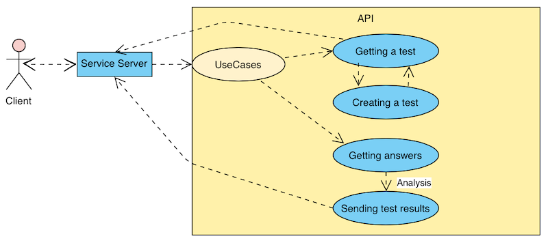

## Функциональные и нефункциональные требования

### А. Функциональные
1. Система должна получать входные данные о пользователе в формате JSON.

2. Система должна обрабатывать входные данные о пользователе и выбирать, какой вариант необходимо сгенерировать.

3. Система должна генерировать вариант по входным данным об ученике.

4. Система должна отправлять на сервер платформы вариант в формате JSON.

5. Система должна получать ответы в формате JSON на отправленный ранее вариант.

6. Система должна анализировать ответы на вариант и проверять его.

7. Система должна генерировать сообщение, в котором содержатся указание на пробелы в знаниях, указание на хорошо освоенные темы, оценка тестирования по 100 бальной шкале.

8. Система должна отправлять сообщение из п.7 серверу платформы в формате JSON.

### Б. Нефункциональные
1. Система должна проверять работу очень быстро. 

2. Для работы с системой необходимо интернет-подключение.
	
3. Все исходные файлы должны быть полностью задокументированы.

4. Формат принимаемых и отправляемых сообщений должен быть указан в документации.

5. Система должна быть конфиденциальна.

6. Система не должна завершаться аварийно.

7. Система должна работать в любом браузере и на любом устройстве.

8. Система должны быть декомпозирована и позволять вносить изменения в код без ущерба.

## Компонентная модель
*<ins>[Компонентная диагрмма решения](https://github.com/ShvDanil/Excellent/blob/main/readme_images/Component_model.png)</ins>*       
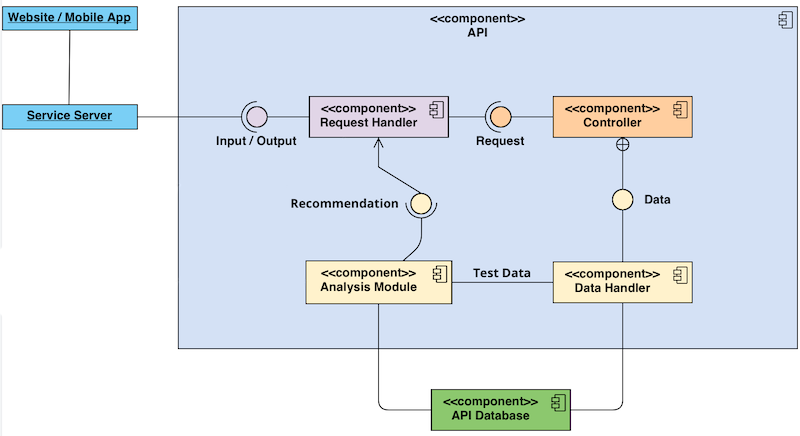

Выше представлена компонентная диаграмма решения. Связь пользователя, платформы и API, отвечающего за выполнение всей работы, реализуется за счет внутренних компонентов, находящихся в общей системе. Каждый компонент - подсистема, выполняющая определнную задачу, реализующая конкретную функцию. Так, схема содержит несколько копонентов:
* **Система-обработчик запроса (Request Handler System).** Эта подсистема отвечает за получение запроса с данными с сервера платформы и передачу запроса и данных контроллеру.

* **Контроллер (Controller).** Эта подсистема, получает запрос от системы-обработчика запросов, обрабатывает его и направляет в соответствующую подсистему с данными для дальнейшей работы.

* **Система обработчика и анализа данных (Data Handler & Analysis System).** Эта подсистема, получая данные, проводит их анализ и возращает результат в тело обработчика запроса для передачи ответа на платформу.

* **Подсистема база данных API (API Database), или место хранения данных (DataStorage).** Это база данных, содержащая информацию о пользователях, примеры тестов с ответами на них, результаты пользователей и их рекомендации.

* **Подсистема рекомендаций искусственного интеллекта (Recommendation AI System).** Это искусственный интеллект, который генерирует рекомендации и создает ответы пользователям в зависимости от результатов теста, написанного ими ранее.

## Референсные архитектуры и паттерны
Одними из ключевых вещей при разработке архитектуры служат **референсная архитектура и паттерны**, которые соответствуют исследуемой предметной области.

### Монолитная архитектура
Один из [основных источников](https://microservices.io/patterns/monolithic.html) о монолитной архитектуре сообщает: данный подход основан на принципе разделения ответственностей. ПО разделяется на слои, лежащие друг на друге. Каждый слой выполняет закрепленную за собой обязанность.

Возникает вопрос, правильна ли эта архитектура в контексте нашего API? Если да, почему?

Проанализировав компоненты (слои), поняв то, как любая EdTech платформа будет взаимодействовать с нашим API, мы осознали, что крайне важной особенностью нашего продукта является его быстрая работа: пользователь, выполнив запрос, должен практически сразу же получить желаемый результат. А слабая связанность слоев монолитной архитектуры повышает управляемость и скорость работы API. Также изолирование слоев помогает защитить одни слои от изменений, произведенных в других. Соответственно, это как раз то, что нам требовалось.

Как будет выглядеть монолит проекта?
Он будет состоять из следующих основных слоев:
* слой представления (Presentation layer);

* слой бизнес-логики (Business Logic layer);

* слой передачи данных (Data Link layer).

Предлагаю обсудить каждый из них подробнее.

* **Слой представления (Presentation layer)** содержит пользовательский интерфейс. Его реализацией будет заниматься платформа, использующая наш API.

* **Слой бизнес-логики (Business Logic layer)** содержит бизнес-логику программного обеспечения. Также он отделяет UI/UX от вычислений, связанных с бизнесом. Это позволяет без труда изменять логику слоя в зависимости от меняющихся бизнес-требований, не влияя при этом на другие слои.

* **Слой передачи данных (Data Link layer)** отвечает за взаимодействие API с базой данных, обеспечивая хранение и обработку информации, которая не связана с бизнесом.

Теперь посмотрим на то, как выглядит [монолитная архитектура и ее слои](https://github.com/ShvDanil/Excellent/blob/main/readme_images/Monolithic_architecture.png) на схеме:
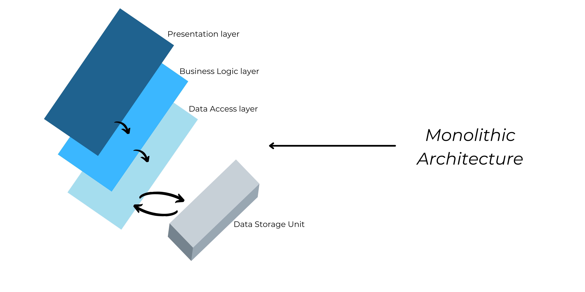

### Сервис-ориентированная архитектура (SOA)
Один из [основных источников](https://www.ibm.com/ru-ru/cloud/learn/soa) о сервис-ориентированной архитектуре определяет ее следующие базовые элементы:
* сервисы (Services);

* сервисная шина (Service Bus);

* сервисный репозиторий (Service Repository catalogue of services);

Для чего нашему API необходима эта архитектура и ее конкретные компоненты? Предлагаем провести анализ описанных выше элементов.

* Существуют разные виды и типы **сервисов**, однако наиболее подходящий для данного решения - **композиционный вспомогательный сервис (Composite Utility Service)**. Так как сервис композиционный, подразумевается, что он будет сочетать в себе несколько атомарных сервисов, не подлежащих дальнейшей декомпозиции. Это обеспечит сложную составную функциональность и позволит принимать данные, обрабатывать их и выдавать необходимый ответ для разных, отличающихся друг от друга запросов (request / reply pattern). Наш проект будет иметь несколько сервисов, так как подразуемваются приемы и ответы на разные запросы.

* **Сервисная шина, или ESP (Enterprise Service Bus)** - связующее звено системы, обеспечивающее обмен информацией между пользователем-платформой и API. Она отвечает за оркестровку и маршрутизацию данных, поступивших с пользовательской стороны.

* С помощью **сервисного репозитория (Service Repository catalogue of services)** ESB направляет запрос в специальный сервис, который (возможно) взаимодействует с другим сервисом (сервисами) или нижними слоями монолита, чтобы подготовить данные для ответа.

Рассмотрев данную референсную архитектуру, стоит также описать **паттерн**, который будет задействован в ходе разработки API.

### Request / Reply pattern
Как мы можем выстроить взаимодействие пользователь-платформа-API напрямую и без сложностей?

Для этого нам понадобится **Request / Reply pattern**, который полностью удовлетворяет требованиям по работе между пользователем-платформой и API. Работа данного паттерна заключается в получении запроса и предоставлении ответа на него. Когда сервис получает запрос от пользователя, он передает данные в соотвествующую подсистему API в должном формате, затем происходит моментальная синхронная обработка данных, и они возвращаются в соответствующем формате в виде ответа на исходный запрос. 

Далее будет представлена схема данного паттерна, на которой изображен сервис, посылающий запрос на API и получающий ответ на него.

*<ins>[Общая схема паттерна](https://github.com/ShvDanil/Excellent/blob/main/readme_images/Request_Reply_pattern.png)</ins>*                          
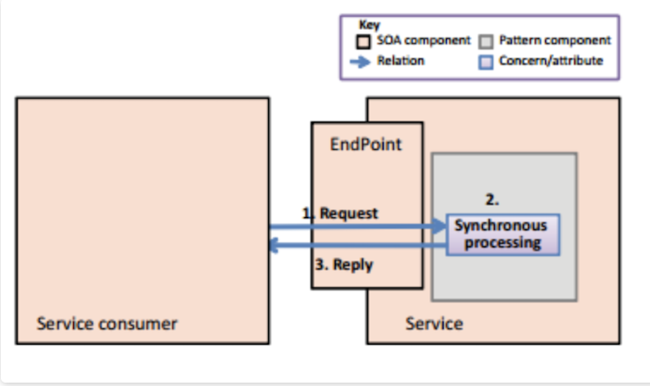

Однако на этом не все. Данные должны где-то храниться, их должны откуда-то получать с целью использования. Перейдем к следующему виду референсной архитектуры.

### Database per Service architecture
[Эта референсная архитектура и ее паттерн](https://microservices.io/patterns/data/database-per-service.html) вытекают из сервис-ориентированной архитектуры, так как она отвечает за организацию данных в сервисах слоя бизнес-логики.

Доступ к базе данных API предоставляется с помощью самого нижнего слоя монолитной архитектуры ("Слой передачи данных"), с которого идет запрос в блок хранения данных (базу данных API), где содержатся нужные таблицы с необходимыми данными для отработки запроса и предоставления ответа на него. Более того, он является единственным слоем, который взаимодействует с базой данных.

Более того, так как только соответствующие системы слоя бизнес-логики могут взаимодействовать с базой данных и необходимыми таблицами в ней, можно сказать, что решение использует Database per Service architecture.

## Дизайн решения
Итак, *<ins>[итоговый дизайн решения](https://github.com/ShvDanil/Excellent/blob/main/readme_images/Monolithic_architecture.png)</ins>*. Он изображен здесь:

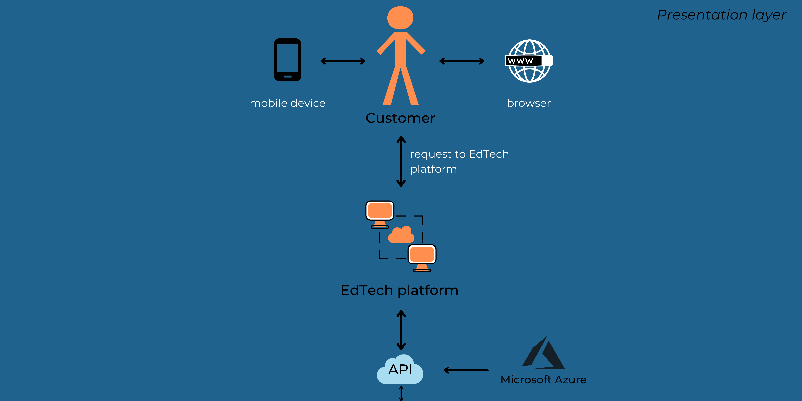
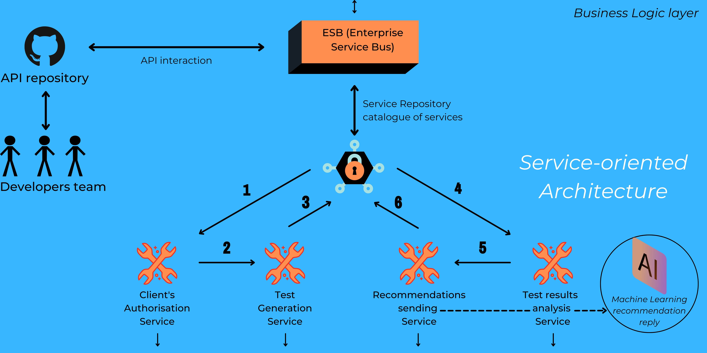
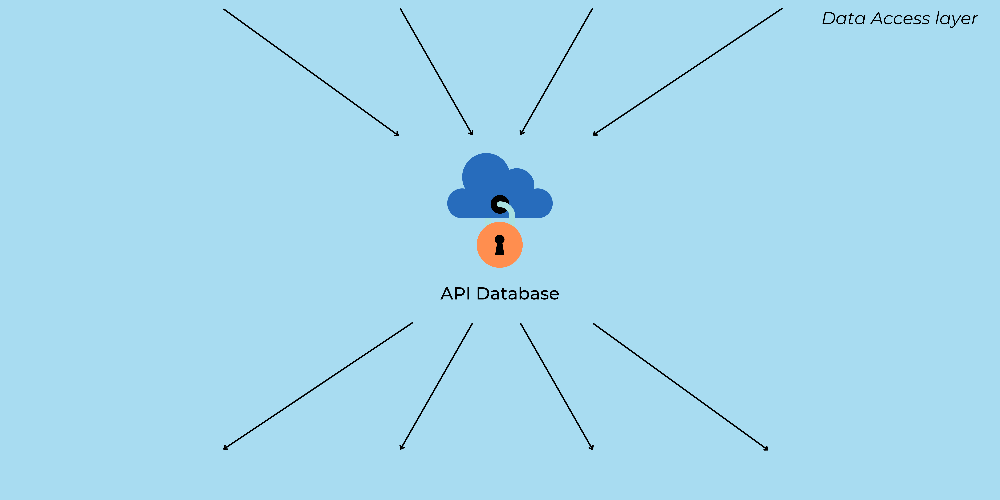
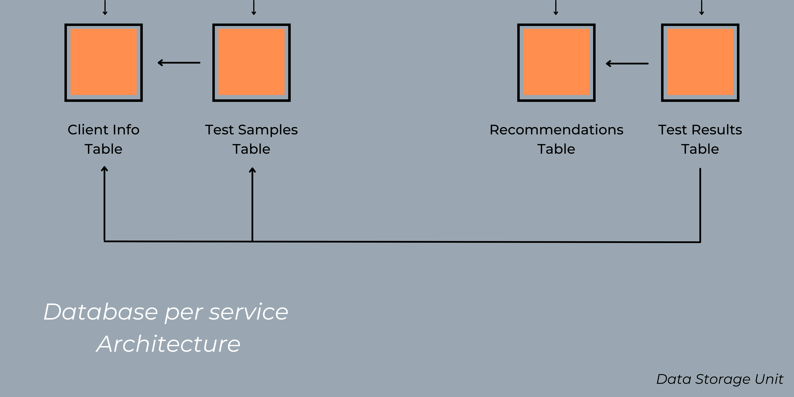

# ENG - english version

## API for student and tutor search services
This repository describes the solution of the case **Excellent - API for student and tutor search services**. 
It contains information about the domain analysis, use cases, functional and non-functional requirements, component model, proposed architecture and patterns of the solution.

## Contents at a Glance
* [Domain analysis](./README.md#Domain-analysis)

* [Use cases](./README.md#Use-Cases-ENG)

* [Functional and non-functional requirements](./README.md#Functional-and-non-functional-requirements)

* [Component model](./README.md#Component-model)

* [Reference architecture and patterns](./README.md#Reference-architecture-and-patterns)

* [Design solution](./README.md#Design-solution)

## Domain analysis

### A. Introduction
The number of tutors is increasing from year to year. They help with preparation:
- for the first class;

- for entering a prestigious school;

- for passing state exams;

- for a creative test at a university;

- for the student Olympics.

Tutors also help to:
- to improve academic performance;

- to study the subject in depth.

Moreover, the number of clients is also growing up. According to the Internet portal [Rambler:](https://news.rambler.ru/sociology/43812515-eksperty-obyasnili-pochemu-k-2021-godu-v-rossii-vyrastet-potrebnost-v-repetitorah/?utm_content=news_media&utm_medium=read_more&utm_source=copylink) "70% of Russian schoolchildren continue using the services of tutors and visit additional education courses after lessons," furthermore the scientific and educational portal [IQ.HSE](https://iq.hse.ru/news/361059490.html) reports that the approximate turnover of the private tutoring market in three years has grown by almost 70 billion rubles. It means that there is the inherent need for additional classes and shows the need to expand and improve the market for services that provide students with personnel, as well as the need for the personnel themselves.

Due to many problems, the largest services and marketplaces lose part of their profits, as well as their potential paying audience. We will list some of them:
* paid trial lessons and their low efficiency;

* inconsistency of the portfolio with reality;

* unwillingness to continue classes after the first meeting;

* waste of time - the most valuable resource of the 21st century;

* decrease in the conversion rate and refusal to use the services of the marketplace.

These are all key factors that inspired the various solutions. Our purpose is to create an API for student and tutor search services that will save them both time and money. The API will select a tutor based on the results of the student's entrance testing, which makes the search as fast, convenient, and efficient as possible. With such software, on each platform it will be possible to competently build interaction between clients and tutors, increase income and popularity in the market.

The API will be a b2b (business to business) solution for a specific service, where the service pays for using the API.

### B. Clients and users
Potential clients - small online-schools, and large services and marketplaces specialising in the provision of educational services (the EdTech market). There are about a hundred services and online schools in Russia involved in the education sector in total. Each of them is currently actively developing and expanding the audience of their potential customers, as well as working to improve the user-experience.

### C. How is the search for a tutor and matching a client with him currently arranged?
1. The client chooses the platform on which he wants to find a tutor.

2. The client registers and draws up his profile.

3. The client is looking for a tutor and sends him an offer to conduct an introductory lesson, or the teacher invites the client to use his services.

4. The client and the teacher agree to conduct a trial lesson (either for free with a time limit, or for the price of one lesson).

5. After the trial lesson, if the tutor is not suitable for the client, the client continues to search for a teacher.

Paragraph *(2)* may entail a discrepancy between the client's knowledge and the portfolio that they or their parents made. You can also notice that items *(3)*, *(4)* and *(5)* can be extremely time consuming and have low efficiency, so there is a need to improve the efficiency of the match between the two sides.

### D. Environment
The service using our API will provide customers with the full access to the required functions. So, users will be able to choose the required subject for writing a test and then solve the test our API had currently generated. After examination, users will receive their results, and tutors will have information about the knowledge gaps of the students and about the topics that the students know well. 
Now, we would like to pay attention to several number of advantages that our solution provides:
1. Users do not need to install additional extensions or download additional software to use this function, since it will already be built into the service.

2. Writing a test paper will allow you to enter actual data about the client's knowledge in general information about him, which will facilitate the search and selection of a teacher and save time for both parties.

### E. Competitors
After getting acquainted with competing solutions, we can note the following types of competitors: replacement and indirect.

The first type includes companies offering related services. For example, Skyeng, whose clients and teachers are matched by analysing the psych types of students and teachers: "We are experimenting with scoring teachers using psychological tests during selection," [says](https://habr.com/ru/post/446970/) the head of product management at the online-school children's department.

The second type describes companies that focus on the same needs of customers of the same market, the EdTech market. For example: [Profi.ru](https://profi.ru), [Repetitor.ru](https://repetitor.ru), [the Association of Tutors](https://repetit.ru/?roistat_visit=39748148), etc.

### F. General information about sphere
1. The demand for the services of tutors is growing, and accordingly, new solutions are required to improve the work of the services for finding teachers.

2. After analysing the market associated with services in the field of education, we identified our goal - to increase the money turnover of services for the selection of tutors by improving user-experience and the quality of their work, and reducing the time allotted for finding a teacher.

3. According to [IQ.HSE](https://iq.hse.ru/news/361059490.html), the approximate turnover of the tutoring market is 100 billion rubles. This turnover is the capacity of the entire market.

## Use cases ENG
First of all, client is a website, program or service that uses our API.

### Getting a screening test

**Description:** The client receives an examination test according to its request.

**Preconditions:** The client is authorised (has access to the service).

**Result:** The client receives a JSON version of the validation test.

**Trigger:** The client sends a request to the service.

**Successful scenario:**

1. The system receives a request.

2. The system checks the request for correctness.

3. The system unpacks the request body, gets the student data, and saves it.

4. The system creates an instance of the test in accordance with the student’s data.

5. The system forms correct answers for test.

6. The system sends a response to the client.

**Alternative scenarios:**

(2) If the request is invalid, the service reports about an error to the client.

### B. Creation of instance of exam test

**Description:** The system creates an instance of test.

**Preconditions:** The client's request is correct.

**Result:** A test is created.

**Trigger:** --

**Successful scenario:**

1. The system receives assignments from the FIPI website in accordance with the student's category.

2. The system determines the topic of each task.

3. The system determines the correct answer for each task.

4. The system generates a unique identifier for the test.

5. The system adds the test job to the database.

**Alternative scenarios:**

(1) If there is no access to the FIPI website or the necessary tasks were not there, the system takes the prepared tasks from the database.

### C. Receiving answers for test

**Description:** The client sends the student answers to the service.

**Preconditions:** The client has successfully received the test.

**Result:** The system receives the student's answers.

**Trigger:** The client sends a request containing student’s answers and a unique ID for the test.

**Successful scenario:**

1. The system receives a request.

2. The system checks the request for correctness.

3. The system unpacks the request body, receives the student's answers, and saves them.

4. The system receives the verification test from the database by a unique identifier.

**Alternative scenarios:**

(2) If the request is invalid, the service reports about the error to the client.

### D. Sending Assessment Results to Client

**Description:** The system sends the student's assessment results in response to a request with his answers.

**Preconditions:** The request with the students' answers was correct.

**Result:** The client receives the student assessment results.

**Trigger:** --

**Successful scenario:**

1. The system compares the student's answers with the correct answers of the test, taken from the database by a unique identifier.

2. The system determines student's knowledge in each topic of the test based on the comparison from paragraph (1).

3. The system compiles a list of test topics and the student's score in this topic.

4. The system generates a response from this list.

5. The system sends a response to the client.

**Alternative scenarios:** --

*<ins>[**Use cases** diagram](https://github.com/ShvDanil/Excellent/blob/main/readme_images/Use_cases.png)</ins>*                           

## Functional and non-functional requirements 

### A. Functional requirements
1. The system should receive input data about the student in JSON format.

2. The system must process input data and choose a test to generate.

3. The system should parse the FIPI website and generate test based on the input data about the student based on tasks from the “open bank”.

4. The system should send test to the server in JSON format.

5. The system should receive response with answers in JSON format for the previously submitted test.

6. The system should analyze answers to the test and validate it.

7. The system should generate a message in which: an indication of gaps in knowledge, an indication of well-mastered topics, a test score on a 100-point scale.

8. The system must send the message from clause 7 to the server in JSON format.

### B. Non-functional
1. The system must check the performance very quickly. (Must be very fast)

2. An Internet connection is required to work with the system.

3. All source files must be fully documented.

4. The format of received and sent messages should be specified in the documentation.

5. The system must be kept confidential.

6. The system must not crash.

7. The system must work in any browser and on any device.

8. The system must be decomposed and allow changes to the source code without prejudice.

## Component model
*<ins>[Component diagram of solution](https://github.com/ShvDanil/Excellent/blob/main/readme_images/Component_model.png)</ins>*

There is a component diagram of a solution above this paragraph. The communication between the client-server and the API, which is responsible for the execution of all work, is realized through internal components located inside the overall system. Each component is a subsystem that performs a specific task that implements a specific function. So, the scheme contains several components:
* **Request Handler.** This subsystem is responsible for receiving the request from the server and transmitting it to the controller.

* **Controller.** This subsystem receives a request from the request processor, processes it and sends it to the appropriate subsystem with data for further work.

* **Data Handler.** This subsystem receives data, works on it, and transmits it for analysis.

* **Analysis module.** This subsystem receives ready data and process it, analyzes, and returns the result to the body of the request handler to transmit the response to the server.

* **API Database.** This is a database containing test samples and answers to them.

## Reference architecture and patterns
Reference architecture and patterns that fit the domain are key things during the project development.

### SOA - Service Oriented Architecture
First of all, list of [basic elements of SOA](https://www.ibm.com/cloud/learn/soa):
* Services;

* Service bus;

* Service repository catalogue of services;

* SOA security;

* SOA governance.

There are different kinds and types of services, but the most suitable for our solution is the **Composite Utility Service**. Since the service is composite, it is assumed for combining several atomic services that are not to further decomposition. This will provide complex composite functionality and allow API to receive data, process it and issue the required response for different requests (request / reply pattern).

**The service bus, or ESP (Enterprise Service Bus),** is the connecting link of the system that provides the exchange of information between the client-server and the API. It is responsible for the orchestration and routing of data received from the user side. (User - server)

The ESB uses the **Service Repository** catalog of services to send a request to a special service that interacts with other service(s) and database(s) to prepare data for the response.

The final two sections, **SOA Security and SOA Governance**, govern SOA security and governance to ensure that a secure and correct client-server transaction (API) is executed.

*<ins>[Schematic presentation of main SOA components interaction](https://github.com/ShvDanil/Excellent/blob/main/readme_images/SOA_scheme.png)</ins>*
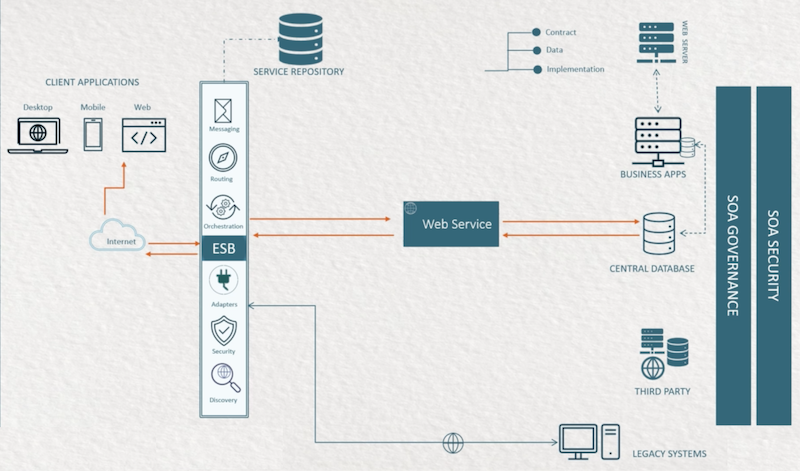

Having considered the reference architecture let us describe the patters which are used during the development of API.

### Client / Server / Service pattern
Before development, the question arises: how is it possible to associate SOA with a service user interface, where the client side does not support SOA or uses technologies that are incompatible with this architecture?

For this case, we use the **Client / Server / Service pattern**, which allows us to associate the service with our API. Integration of this pattern as a new service on the server side will minimise the impact on the UI and other existing systems. Next, a diagram of this pattern will be presented, where the role of our API depicts the lower layer of the server agent and its interaction with servers A and B.

*<ins>[Common pattern scheme](https://github.com/ShvDanil/Excellent/blob/main/readme_images/Client_Server_Service_pattern.png)</ins>*                          
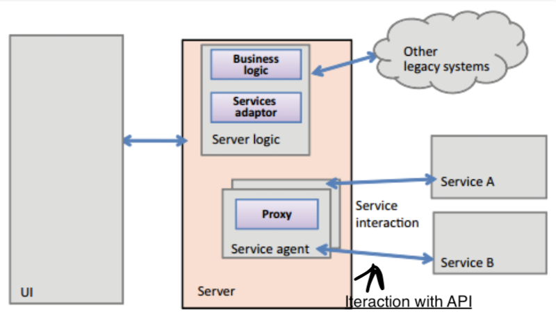

However, the image of this pattern is only generalised, since it in general terms, without any specifics, describes the methods of interaction between the API and the service. For a more detailed description of interactions, let's move on to the next pattern, which contains specific information about the interaction.

### Request / Reply pattern
How can we structure the client-server-API interaction directly and without complexity?

For this case, we need a **Request / Reply pattern** that fully satisfies the requirements for working between the above-described sides. The aim of this pattern is to receive a request and provide a response to it. When a service receives a request from a user, it transmits data to the appropriate API subsystem in the correct format, then the data is instantly processed synchronously and returned in the appropriate format as a response to the original request. Next, a diagram of this pattern will be presented. It depicts a service that sends a request to an API and receives a response to it.

*<ins>[Common pattern scheme](https://github.com/ShvDanil/Excellent/blob/main/readme_images/Request_Reply_pattern.png)</ins>*                          

## Design solution
Here you can see the *<ins>[final solution design](https://github.com/ShvDanil/Excellent/blob/main/readme_images/Design_solution.png)</ins>*:
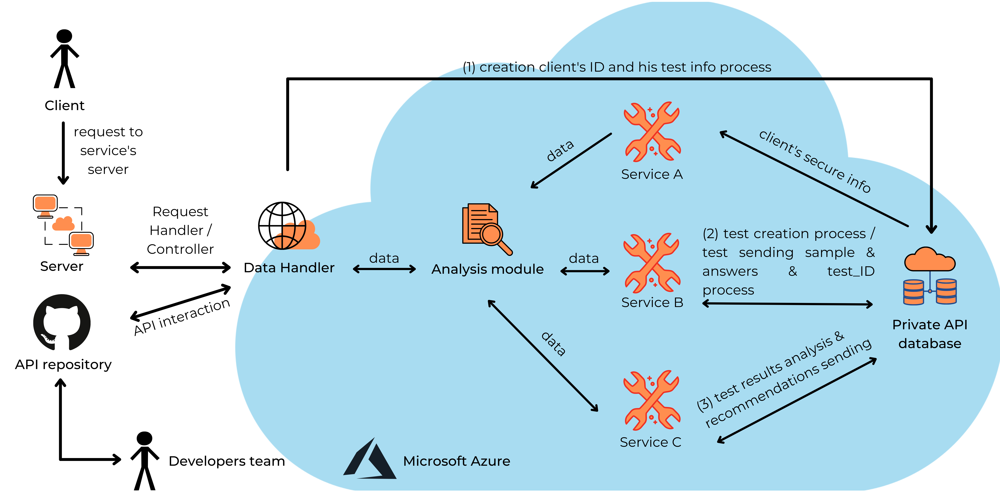
