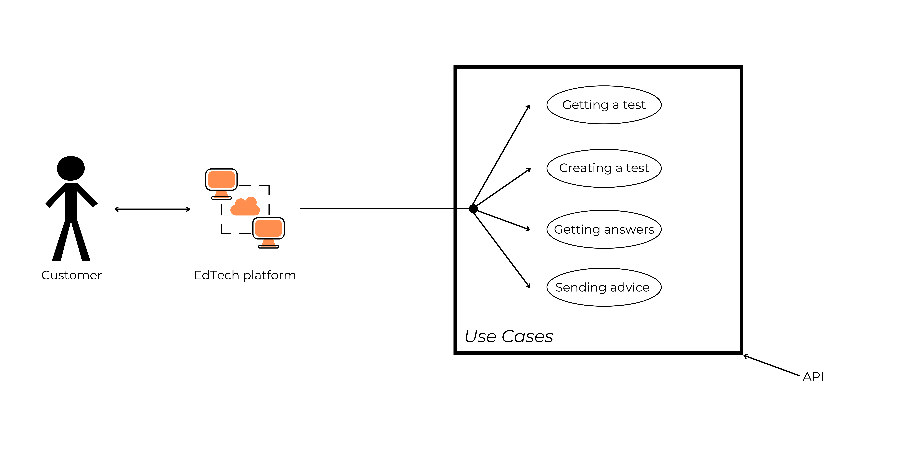
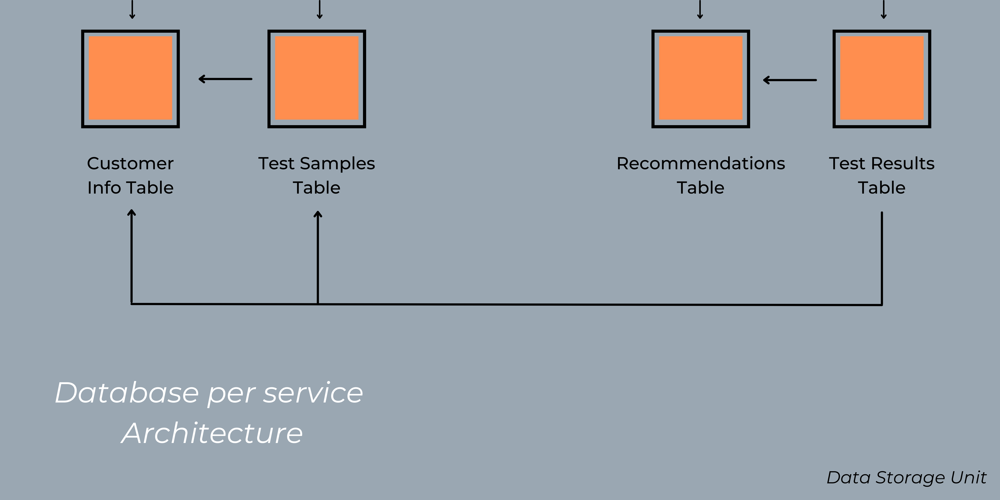

# Excellent 

## API для сервисов по поиску учеников и репетиторов
В этом репозитории описано решение кейса **Excellent — API для сервисов по поиску учеников и репетиторов**.
В нем будет информация о доменной области проекта, юз-кейсах, функциональных и нефункциональных требованиях, компонентной модели, предлагаемых архитектурах и паттернах решения, а также дизайн решения.

## Содержание
* [Описание доменной области](./README.md#Описание-доменной-области)

* [Use Cases](./README.md#Use-Cases)

* [Функциональные и нефункциональные требования](./README.md#Функциональные-и-нефункциональные-требования)

* [Компонентная модель](./README.md#Компонентная-модель)

* [Референсные архитектуры и паттерны](./README.md#Референсные-архитектуры-и-паттерны)

* [Дизайн решения](./README.md#Дизайн-решения)

## Описание доменной области

### А. Введение
Из года в год увеличивается количество репетиторов, которые помогают подготовиться
- к первому классу;

- к поступлению в престижную школу; 

- к сдаче государственных экзаменов;

- к творческому испытанию в вузе;

- к олимпиаде;

- подтянуть успеваемость;

- изучить предмет углубленно.

Более того, растет и количество клиентов. По данным интернет-портала [Рамблер:](https://news.rambler.ru/sociology/43812515-eksperty-obyasnili-pochemu-k-2021-godu-v-rossii-vyrastet-potrebnost-v-repetitorah/?utm_content=news_media&utm_medium=read_more&utm_source=copylink) "70% российских школьников продолжают посещать репетиторов и курсы дополнительного образования после уроков", - а научно-образовательный портал [IQ.HSE](https://iq.hse.ru/news/361059490.html) сообщает о том, что приблизительный оборот рынка частного репетиторства за три года вырос практически на 70 млрд.руб. Это говорит о неотъемлемой потребности в дополнительных занятиях и показывает необходимость расширения и улучшения рынка сервисов, обеспечивающих учеников кадрами, а также необходимость в самих кадрах.

Из-за многих проблем крупнейшие сервисы и маркетплейсы теряют часть своей прибыли, а также потенциальную платежеспособную аудиторию. О каких проблемах идет речь?
* Платные пробные занятия при поиске репетитора и их низкая эффективность;

* несоответствие портфолио действительности;

* нежелание продолжать занятия после первой встречи;

* потеря времени - самого ценного ресурса 21 века;

* уменьшение коэффициента конверсии или отказ от пользования услугами сервиса.

Все это является ключевыми факторами, которые послужили идеей для анализа ситуации, сложившейся на рынке, и нахождения различных решений. Наша цель — создать программное обеспечение (API) для сервисов по поиску учеников и репетиторов, которое позволит им экономить время и деньги. API будет подбирать репетитора на основе результатов вступительного тестирования ученика, что позволит сделать поиск максимально быстрым, удобным и эффективным. Используя это программное обеспечение, каждая платформа сможет грамотно выстроить взаимодействие между пользователями и репетиторами, повысить доходы и увеличить популярность на рынке.

API будет являться b2b (business to business) решением для конкретной платформы, где платформа платит за пользование API.
 
### Б. Клиенты и пользователи
Потенциальные клиенты - это как небольшие онлайн-школы, так и крупные платформы, маркетплейсы, специализирующиеся на предоставлении услуг в сфере образования. Всего в России насчитывается около сотни сервисов и онлайн-школ, задействованных в сфере образования. Каждая из них в настоящее время активно развивается и расширяет аудиторию своих потенциальных клиентов, а также работает над улучшением user-experience.
 
### В. Как устроен поиск репетитора и мэтчинг пользователя с ним в настоящее время?
1. Пользователь выбирает платформу, на которой он хочет подобрать себе репетитора.

2. Пользователь регистрируется и составляет свою анкету.

3. Пользователь ищет преподавателя и отправляет ему предложение о проведении вводного урока или же преподаватель предлагает пользователю воспользоваться своими услугами.

4. Пользователь и преподаватель договариваются о проведении пробного занятия (либо за бесплатно с ограничением по времени, либо за цену одного занятия).

5. Если после проведения пробного занятия репетитор не подходит пользователю, пользователь продолжает поиски репетитора.

Пункт *(2)* может влечь за собой несоответствие знаний пользователя тому портфолио, которое составил он или его родители. Также можно заметить, что пункты *(3)*, *(4)* и *(5)* могут быть крайне время затратными и иметь низкую эффективность, поэтому возникает необходимость в повышении эффективности мэтчинга между двумя сторонами. 

### Г. Окружение
Платформа, использующая наше API, обеспечит пользователям полный доступ к требуемым функциям. Так, пользователи, используя любое устройство (мобильный телефон, планшет, ноутбук, ПК), имеющее доступ к платформе, смогут выбрать необходимый предмет для написания проверочной работы, внести ответы в тестирующую систему. Затем они получат результат написанной работы, а также увидят соответствующие рекомендации. Преподаватели же увидят рекомендации пользователей для проведения занятий.
Данный алгоритм работы имеет ряд преимуществ:
1. Пользователям не нужно устанавливать дополнительные расширения или скачивать дополнительное ПО для использования данной функции, поскольку она уже будет встроена в платформу;

2. Написание проверочной работы позволит внести актуальные данные о знаниях пользователей в общую информацию о них, что облегчит поиск и подбор преподавателя и сэкономит время обеих сторон.

### Д. Конкуренты
Познакомившись с конкурирующими решениями, мы можем отметить следующие типы конкурентов: непрямые и косвенные.

К первому типу относятся компании, предлагающие смежные по своим свойствам услуги. Например, это компания Skyeng, мэтчинг пользователей и преподавателей которой происходит благодаря анализу психотипов студентов и учителей: "Мы ведём эксперименты по скорингу учителей с помощью психологических тестов во время отбора", - [заявляет](https://habr.com/ru/post/446970/) руководитель продакт-менеджмента детского направления онлайн-школы.

Второй тип - это компании, ориентирующиеся на одни и те же потребности клиентов одного рынка, то есть Ed-tech рынка. К примеру, это сервисы [Profi.ru](https://profi.ru), [Repetitor.ru](https://repetitor.ru), [Ассоциация репетиторов](https://repetit.ru/?roistat_visit=39748148) и другие.
 
### Е. Общая информация о сфере
1. Спрос на услуги частных репетиторов растет, соответственно требуются новые функции для улучшения работы платформ по поиску преподавателей.

2. Проанализировав рынок, связанный с услугами в сфере образования, мы выявили нашу главную цель - увеличение денежного оборота платформ по подбору репетиторов за счет улучшения качества их работы и сокращения времени, отводимого на поиск преподавателя. 

3. Примерный оборот рынка частного репетиторства по данным [IQ.HSE](https://iq.hse.ru/news/361059490.html) составляет 100 млрд.руб. Этот оборот - емкость всего рынка.

## Use Cases

### А. Получение проверочной работы

**Описание:** Пользователь получает проверочную работу в соответствии со своим запросом. 

**Предусловия:** Пользователь авторизован (имеет доступ к платформе). 

**Результат:** Пользователь получает вариант проверочной работы в формате JSON. 

**Триггер:** Пользователь отправляет запрос платформе. 

**Успешный сценарий:**

1. Система получает запрос.

2. Система проверяет запрос на корректность. 

3. Система распаковывает тело запроса, получает данные о пользователе и сохраняет их.

4. Система создает вариант проверочной работы в соответствии с данными о пользователе.

5. Система формирует из проверочной работы ответ пользователю.

6. Система отправляет ответ пользователю.

**Альтернативные сценарии:** 

(2) Если запрос некорректный, платформа сообщает об ошибке пользователю. 

### Б. Создание проверочной работы

**Описание:** Система создает проверочную работу.

**Предусловия:** Запрос пользователя корректен.

**Результат:** Создается проверочная работа. 

**Триггер:** --

**Успешный сценарий:**

1. Система создает (извлекает) задания в соответствии с категорией пользователя.

2. Система определяет тему каждого задания.

3. Система определяет правильный ответ каждого задания.

4. Система создает уникальный идентификатор проверочной работы.

5. Система добавляет проверочную работу в базу данных.

**Альтернативные сценарии:** --

### В. Получение ответов 

**Описание:** Пользователь отправляет ответы платформе, а платформа системе.

**Предусловия:** Пользователь успешно получил проверочную работу.

**Результат:** Система получает ответы ученика. 

**Триггер:** Система отправляет запрос с ответами пользователя и уникальным идентификатором проверочной работы.

**Успешный сценарий:**

1. Система получает запрос.

2. Система проверяет запрос на корректность. 

3. Система распаковывает тело запроса, получает ответы пользователя и сохраняет их.

4. Система получает по уникальному идентификатору проверочную работу из базы данных.

**Альтернативные сценарии:** 

(2) Если запрос некорректный, сервис сообщает об ошибке пользователю. 

### Г. Отправка результатов оценивания пользователю 

**Описание:** Система отправляет результаты оценивания пользователя в ответ на запрос с его ответами.

**Предусловия:** Запрос с ответами пользователя был корректен.

**Результат:** Платформа получает результаты оценивания ученика. 

**Триггер:** --

**Успешный сценарий:**

1. Система сравнивает ответы пользователя с правильными ответами проверочной работы, взятой из базы данных по уникальному идентификатору.

2. Система определяет знания пользователя в каждой теме проверочной работы на основе сравнения из пункта (1).

3. Система составляет список тем проверочной работы и набранный пользователем балл в этой теме.

4. Система формирует ответ из этого списка.

5. Система отправляет ответ платформе.

**Альтернативные сценарии:** --

*<ins>[Диаграмма, изображающая **Use cases**](https://github.com/ShvDanil/Excellent/blob/main/readme_images/use_cases.png)</ins>*

## Функциональные и нефункциональные требования

### А. Функциональные
1. Система должна получать входные данные о пользователе в формате JSON.

2. Система должна обрабатывать входные данные о пользователе и выбирать, какой вариант необходимо сгенерировать.

3. Система должна генерировать вариант по входным данным об ученике.

4. Система должна отправлять на сервер платформы вариант в формате JSON.

5. Система должна получать ответы в формате JSON на отправленный ранее вариант.

6. Система должна анализировать ответы на вариант и проверять его.

7. Система должна генерировать сообщение, в котором содержатся указание на пробелы в знаниях, указание на хорошо усвоенные темы, оценка тестирования по 100 бальной шкале.

8. Система должна отправлять сообщение из п.7 серверу платформы в формате JSON.

### Б. Нефункциональные
1. Система должна проверять работу очень быстро. 

2. Для работы с системой необходимо интернет-подключение.
	
3. Все исходные файлы должны быть полностью задокументированы.

4. Формат принимаемых и отправляемых сообщений должен быть указан в документации.

5. Система должна быть конфиденциальна.

6. Система не должна завершаться аварийно.

7. Система должна работать в любом браузере и на любом устройстве.

8. Система должна быть декомпозирована и позволять вносить изменения в код без ущерба.

## Компонентная модель
*<ins>[Компонентная диагрмма решения](https://github.com/ShvDanil/Excellent/blob/main/readme_images/Component_model.png)</ins>*       

Выше представлена компонентная диаграмма решения, созданная по информации о лучших практиках [IBM](https://developer.ibm.com/articles/the-component-diagram/). 

Связь пользователя, платформы и API, отвечающего за выполнение всей работы, реализуется за счет внутренних компонентов, находящихся в общей системе. Каждый компонент - подсистема, выполняющая определенную задачу, реализующая конкретную функцию. Так, схема содержит несколько компонентов:

* **Система-обработчик запроса (Request Handler System).** Эта подсистема отвечает за получение запроса с данными с сервера платформы и передачу запроса и данных контроллеру.

* **Контроллер (Controller).** Эта подсистема занимается распределением и маршрутизацией поступившего запроса с данными.

* **Система обработчика и анализа данных (Data Handler & Analysis System).** Эта подсистема проводит анализ данных и возвращает результат в тело обработчика запроса для передачи ответа на сервер платформы.

* **Подсистема база данных API (API Database), или место хранения данных (DataStorage).** Это база данных, которая содержит информацию о пользователях, примеры тестов с ответами на них, результаты пользователей и рекомендации, сгенерированные для них.

* **Подсистема рекомендаций искусственного интеллекта (Recommendation AI System).** Это специально обученный искусственный интеллект, который генерирует рекомендации и создает ответы для пользователей в зависимости от результатов теста, написанного ими ранее.

## Референсные архитектуры и паттерны
Одними из ключевых вещей при разработке архитектуры служат **референсные архитектуры и паттерны**, которые соответствуют исследуемой предметной области.

### Монолитная архитектура
Один из [основных источников](https://microservices.io/patterns/monolithic.html) о монолитной архитектуре сообщает, что данный подход основан на принципе разделения ответственностей. ПО разделяется на слои, лежащие друг на друге. Каждый слой выполняет закрепленную за собой обязанность.

Возникает вопрос, правильна ли эта архитектура в контексте нашего API? Если да, почему?

Проанализировав компоненты (слои), поняв то, как любая EdTech платформа будет взаимодействовать с нашим API, мы осознали, что крайне важной особенностью нашего продукта является его быстрая работа: пользователь, выполнив запрос, должен практически сразу же получить результат. А слабая связанность слоев монолитной архитектуры как раз повышает управляемость и скорость работы API. Также изолирование слоев помогает защитить одни слои от изменений, произведенных в других. Соответственно, это как раз то, что удовлетворяет требованиям API.

Как будет выглядеть монолит проекта?
Он будет состоять из следующих основных слоев:
* слой представления (Presentation layer);

* слой бизнес-логики (Business Logic layer);

* слой передачи данных (Data Link layer).

Предлагаю обсудить каждый из них подробнее.

* **Слой представления (Presentation layer)** содержит пользовательский интерфейс. Его реализацией будет заниматься платформа, использующая наш API.

* **Слой бизнес-логики (Business Logic layer)** содержит бизнес-логику API. Также он отделяет UI/UX от вычислений, связанных с бизнесом. Это позволяет без труда изменять логику слоя в зависимости от меняющихся бизнес-требований, не влияя при этом на другие слои.

* **Слой передачи данных (Data Link layer)** отвечает за взаимодействие API с базой данных, обеспечивая хранение и обработку информации, которая не связана с бизнесом.

Теперь посмотрим на то, как выглядит [монолитная архитектура и ее слои](https://github.com/ShvDanil/Excellent/blob/main/readme_images/Monolithic_architecture.png) на схеме:

### Сервис-ориентированная архитектура (SOA)
Один из [основных источников](https://www.ibm.com/ru-ru/cloud/learn/soa) о сервис-ориентированной архитектуре определяет ее следующие базовые элементы:
* сервисы (Services);

* сервисная шина (Service Bus);

* сервисный репозиторий (Service Repository catalogue of services);

Для чего нашему API необходима эта архитектура и ее конкретные компоненты? Предлагаем провести анализ описанных выше элементов.

* Существуют разные виды и типы **сервисов**, однако наиболее подходящий для данного решения - **композиционный вспомогательный сервис (Composite Utility Service)**. Так как сервис композиционный, подразумевается, что он будет сочетать в себе несколько атомарных сервисов, не подлежащих дальнейшей декомпозиции. Это обеспечит сложную составную функциональность и позволит принимать данные, обрабатывать их и выдавать необходимый ответ для разных, отличающихся друг от друга запросов (request / reply pattern). Наш проект будет иметь несколько сервисов, так как подразумеваются приемы и ответы на разные запросы.

* **Сервисная шина, или ESP (Enterprise Service Bus)** - связующее звено системы, обеспечивающее обмен информацией между пользователем-платформой и API. Она отвечает за оркестровку и маршрутизацию данных, поступивших с пользовательской стороны.

* С помощью **сервисного репозитория (Service Repository catalogue of services)** ESB направляет запрос в специальный сервис, который (возможно) взаимодействует с другим сервисом (сервисами) или нижними слоями монолита, чтобы подготовить данные для ответа.

Рассмотрев данную референсную архитектуру, стоит также описать **паттерн**, который будет задействован в ходе разработки API.

### Request / Reply pattern
Как мы можем выстроить взаимодействие пользователь-платформа-API напрямую и без сложностей?

Для этого нам понадобится **Request / Reply pattern**, который полностью удовлетворяет требованиям по работе между пользователем-платформой и API. Работа данного паттерна заключается в получении запроса и предоставлении ответа на него. Когда сервис получает запрос от пользователя, он передает данные в соответствующую подсистему API в должном формате, затем происходит моментальная синхронная обработка данных, и они возвращаются в соответствующем формате в виде ответа на исходный запрос. 

Далее будет представлена схема данного паттерна, на которой изображен сервис, посылающий запрос на API и получающий ответ на него.

*<ins>[Общая схема паттерна](https://github.com/ShvDanil/Excellent/blob/main/readme_images/Request_Reply_pattern.png)</ins>*                          

Однако на этом не все. Данные должны где-то храниться, их должны откуда-то получать с целью использования. Перейдем к следующему виду референсной архитектуры.

### Database per Service architecture
[Эта референсная архитектура и ее паттерн](https://microservices.io/patterns/data/database-per-service.html) вытекают из сервис-ориентированной архитектуры, так как она отвечает за организацию данных в сервисах слоя бизнес-логики.

Доступ к базе данных API предоставляется с помощью самого нижнего слоя монолитной архитектуры ("Слой передачи данных"), с которого идет запрос в блок хранения данных (базу данных API), где содержатся нужные таблицы с необходимыми данными для отработки запроса и предоставления ответа на него. Также стоит отметить, что он является единственным слоем, который взаимодействует с базой данных.

Более того, так как только соответствующие системы слоя бизнес-логики могут взаимодействовать с базой данных и необходимыми таблицами в ней, можно сказать, что в решении необходимо использование Database per Service architecture.

## Дизайн решения
Итак, *<ins>[итоговый дизайн решения](https://github.com/ShvDanil/Excellent/blob/main/readme_images/Monolithic_architecture.png)</ins>*. Он изображен здесь:

Давайте проанализируем каждую часть (каждый слой) дизайна и покажем, как происходит полный цикл отработки API.

*<ins>[1 - Presentation layer](https://github.com/ShvDanil/Excellent/blob/main/readme_images/Presentation_layer.png)</ins>*

Пользователь решает воспользоваться новой возможностью подобрать себе репетитора, выбирает предмет, по которому он хочет решить вариант и отправляет запрос на сервер EdTech платформы, которая перенаправляет данный запрос для отработки API.

*<ins>[2 - Business Logic Layer](https://github.com/ShvDanil/Excellent/blob/main/readme_images/Business_Logic_layer.png)</ins>*

Это основной слой, на котором зиждется практически весь функционал.

I.

1. Поступает запрос в сервис авторизации клиента для сохранения информации о нем и генерации теста. Так, сервис заносит информацию о пользователе вместе с ID для идентификации в соответствующую таблицу в базе данных и передает управление дальше.

2. Управление передается сервису генерации варианта, который создает (или использует уже существующий) тест для пользователя, а также сохраняет информацию о тесте (задания и ответы на них) и добавляет все данные в соответствующую таблицу базы данных (связанную с таблицей информации о пользователе).

3. Управление передается обратно с помощью сервисного репозитория в ESB для возвращения сгенерированного варианта пользователю.

На этом завершается первый цикл работы API. Для активации второго цикла необходимо, чтобы пользователь решил тест и отправил результаты для получения рекомендаций. 

Представим, что на сервер платформы поступил ответ от пользователя, соответственно на API также поступил запрос.

II.

4. Поступают результаты пользователя в сервис анализа результатов теста. Там происходит обработка полученных ответов, сравнение их с правильными и занесение информации в соответствующую таблицу в базе данных API по ID пользователя.

5. Затем управление передается в сервис создания и отправки рекомендации. Данный сервис взаимодействует, как с соответствующей таблицей в базе данных для получения и сохранения данных, так и с искусственным интеллектом, специально обученным для осуществления генерации уникальной рекомендации для пользователя и отправки сообщения на основе результатов, написанного им теста.

6. В результате сформированный текст и соответствующие рекомендации, содержащие информацию о слабых сторонах и пробелах в знаниях, а также о хорошо усвоенных темах, возвращаются на сервер платформы и к пользователю в дальнейшем с помощью сервисного репозитория и ESB.

На этом завершается полный цикл работы API.

*<ins>[3 - Data Access Layer](https://github.com/ShvDanil/Excellent/blob/main/readme_images/Data_access_layer.png)</ins>*

Этот слой иллюстрирует то, как сервисы из слоя бизнес-логики обращаются к базе данных API для получения или сохранения каких-либо данных о пользователях и вариантах, которые они решали.

*<ins>[4 - Data Storage Unit](https://github.com/ShvDanil/Excellent/blob/main/readme_images/Data_Storage_unit.png)</ins>*

Это краткая и схематическая версия таблиц базы данных API, основная цель которых - хранить информацию о пользователях, тестах и рекомендациях, основанных на их знаниях.
