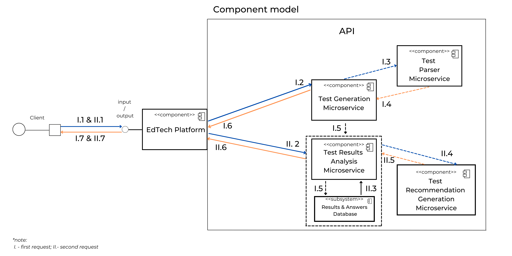

# Excellent 

## API для сервисов по поиску учеников и репетиторов
В этом репозитории описано решение кейса **"Excellent — API для сервисов по поиску учеников и репетиторов"**.
В нем будет информация о доменной области проекта, юз-кейсах, функциональных и нефункциональных требованиях, компонентной модели, предлагаемых архитектурах и паттернах решения, дизайне решения, а также инструкция к запуску.

## Содержание
* [Описание доменной области](./README.md#Описание-доменной-области)

* [Use Cases](./README.md#Use-Cases)

* [Функциональные и нефункциональные требования](./README.md#Функциональные-и-нефункциональные-требования)

* [Компонентная модель](./README.md#Компонентная-модель)

* [Референсные архитектуры и паттерны](./README.md#Референсные-архитектуры-и-паттерны)

* [Дизайн решения](./README.md#Дизайн-решения)

* [Инструкция к запуску](./README.md#Инструкция-к-запуску)

## Описание доменной области

### А. Введение
Из года в год увеличивается количество репетиторов, которые помогают подготовиться
- к первому классу;

- к поступлению в престижную школу; 

- к сдаче государственных экзаменов;

- к творческому испытанию в вузе;

- к олимпиаде;

- подтянуть успеваемость;

- изучить предмет углубленно.

Более того, растет и количество клиентов в сфере образования. По данным интернет-портала [Рамблер:](https://news.rambler.ru/sociology/43812515-eksperty-obyasnili-pochemu-k-2021-godu-v-rossii-vyrastet-potrebnost-v-repetitorah/?utm_content=news_media&utm_medium=read_more&utm_source=copylink) "70% российских школьников продолжают посещать репетиторов и курсы дополнительного образования после уроков", - а научно-образовательный портал [IQ.HSE](https://iq.hse.ru/news/361059490.html) сообщает о том, что приблизительный оборот рынка частного репетиторства за три года вырос практически на 70 млрд.руб. Это говорит о неотъемлемой потребности в дополнительных занятиях и показывает необходимость расширения и улучшения рынка сервисов, обеспечивающих учеников кадрами, а также необходимость в самих кадрах.

Из-за многих проблем крупнейшие сервисы и маркетплейсы теряют часть своей прибыли, а также потенциальную платежеспособную аудиторию. О каких проблемах идет речь?
* Платные пробные занятия при поиске репетитора и их низкая эффективность;

* несоответствие портфолио действительности;

* нежелание продолжать занятия после первой встречи;

* потеря времени - самого ценного ресурса 21 века;

* уменьшение коэффициента конверсии или отказ от пользования услугами сервиса.

Все это является ключевыми факторами, которые послужили идеей для анализа ситуации, сложившейся на рынке, и нахождения решения насущных проблем. Наша цель — создать программное обеспечение (API) для сервисов по поиску учеников и репетиторов, которое позволит им экономить время и деньги. API будет подбирать репетитора на основе результатов вступительного тестирования ученика, что позволит сделать поиск максимально быстрым, удобным и эффективным. Используя это программное обеспечение, каждая платформа сможет грамотно выстроить взаимодействие между пользователями и репетиторами, повысить доходы и увеличить популярность на рынке.

API будет являться b2b (business to business) решением для конкретной платформы, где платформа платит за пользование API.
 
### Б. Клиенты и пользователи
Потенциальные клиенты - это как небольшие онлайн-школы, так и крупные платформы, маркетплейсы, специализирующиеся на предоставлении услуг в сфере образования. Всего в России насчитывается около сотни сервисов и онлайн-школ, задействованных в сфере образования. Каждая из них в настоящее время активно развивается и расширяет аудиторию своих потенциальных клиентов, а также работает над улучшением user-experience.
 
### В. Как устроен поиск репетитора и мэтчинг пользователя с ним в настоящее время?
1. Пользователь выбирает платформу, на которой он хочет подобрать себе репетитора.

2. Пользователь регистрируется и составляет свою анкету.

3. Пользователь ищет преподавателя и отправляет ему предложение о проведении вводного урока или же преподаватель предлагает пользователю воспользоваться своими услугами.

4. Пользователь и преподаватель договариваются о проведении пробного занятия (либо за бесплатно с ограничением по времени, либо за цену одного занятия).

5. Если после проведения пробного занятия репетитор не подходит пользователю, пользователь продолжает поиски репетитора.

Пункт *(2)* может влечь за собой несоответствие знаний пользователя тому портфолио, которое составил он или его родители. Также можно заметить, что пункты *(3)*, *(4)* и *(5)* могут быть крайне время затратными и иметь низкую эффективность, поэтому возникает необходимость в повышении эффективности мэтчинга между двумя сторонами. 

### Г. Окружение
Платформа, использующая наше API, обеспечит пользователям полный доступ к требуемым функциям. Так, пользователи, используя любое устройство (мобильный телефон, планшет, ноутбук, ПК), имеющее доступ к платформе, смогут выбрать необходимый предмет для написания проверочной работы, внести ответы в тестирующую систему. Затем они получат результат написанной работы, а также увидят соответствующие рекомендации. Преподаватели же увидят рекомендации пользователей для проведения занятий.
Данный алгоритм работы имеет ряд преимуществ:
1. Пользователям не нужно устанавливать дополнительные расширения или скачивать дополнительное ПО для использования данной функции, поскольку она уже будет встроена в платформу;

2. Написание проверочной работы позволит внести актуальные данные о знаниях пользователей в общую информацию о них, что облегчит поиск и подбор преподавателя и сэкономит время обеих сторон.

### Д. Конкуренты
Познакомившись с конкурирующими решениями, мы можем отметить следующие типы конкурентов: непрямые и косвенные.

К первому типу относятся компании, предлагающие смежные по своим свойствам услуги. Например, это компания Skyeng, мэтчинг пользователей и преподавателей которой происходит благодаря анализу психотипов студентов и учителей: "Мы ведём эксперименты по скорингу учителей с помощью психологических тестов во время отбора", - [заявляет](https://habr.com/ru/post/446970/) руководитель продакт-менеджмента детского направления онлайн-школы.

Второй тип - это компании, ориентирующиеся на одни и те же потребности клиентов одного рынка, то есть Ed-tech рынка. К примеру, это сервисы [Profi.ru](https://profi.ru), [Repetitor.ru](https://repetitor.ru), [Ассоциация репетиторов](https://repetit.ru/?roistat_visit=39748148) и другие.
 
### Е. Общая информация о сфере
1. Спрос на услуги частных репетиторов растет, соответственно требуются новые функции для улучшения работы платформ по поиску преподавателей.

2. Проанализировав рынок, связанный с услугами в сфере образования, мы выявили нашу главную цель - увеличение денежного оборота платформ по подбору репетиторов за счет улучшения качества их работы и сокращения времени, отводимого на поиск преподавателя. 

3. Примерный оборот рынка частного репетиторства по данным [IQ.HSE](https://iq.hse.ru/news/361059490.html) составляет 100 млрд.руб. Этот оборот - емкость всего рынка.

## Use Cases

### А. Получение проверочной работы

**Описание:** Пользователь получает проверочную работу в соответствии со своим запросом. 

**Предусловия:** Пользователь авторизован (имеет доступ к платформе). 

**Результат:** Пользователь получает вариант проверочной работы в формате JSON. 

**Триггер:** Пользователь отправляет запрос платформе. 

**Успешный сценарий:**

1. Система получает запрос.

2. Система проверяет запрос на корректность. 

3. Система создает вариант проверочной работы в соответствии с данными пользователя.

4. Система формирует из проверочной работы ответ пользователю.

5. Система отправляет ответ пользователю.

**Альтернативные сценарии:** 

(2) Если запрос некорректный, платформа сообщает об ошибке пользователю. 

### Б. Создание проверочной работы

**Описание:** Система создает проверочную работу.

**Предусловия:** Запрос пользователя корректен.

**Результат:** Создается проверочная работа. 

**Триггер:** --

**Успешный сценарий:**

1. Система создает (извлекает) задания в соответствии с категорией пользователя.

2. Система определяет тему каждого задания.

3. Система определяет правильный ответ каждого задания.

4. Система создает уникальный идентификатор проверочной работы.

5. Система возвращает готовую проверочную работу.

**Альтернативные сценарии:** 

(5) Если проверочную работу не удалось создать, платформа возвращает один из заранее подготовленных вариантов (в случае внутренних сбоев).

### В. Получение ответов 

**Описание:** Пользователь отправляет ответы платформе, а платформа системе.

**Предусловия:** Пользователь успешно получил проверочную работу.

**Результат:** Система получает ответы ученика. 

**Триггер:** Система отправляет запрос с ответами пользователя и уникальным идентификатором проверочной работы.

**Успешный сценарий:**

1. Система получает запрос.

2. Система проверяет запрос на корректность. 

3. Система распаковывает тело запроса, получает ответы пользователя и сохраняет их в базу данных к имеющимся правильным ответам.

**Альтернативные сценарии:** 

(2) Если запрос некорректный, сервис сообщает пользователю об ошибке. 

### Г. Отправка результатов оценивания пользователю 

**Описание:** Система отправляет результаты оценивания пользователя в ответ на запрос с его ответами.

**Предусловия:** Запрос с ответами пользователя был корректен.

**Результат:** Платформа получает результаты оценивания ученика. 

**Триггер:** --

**Успешный сценарий:**

1. Система сравнивает ответы пользователя с правильными ответами проверочной работы, взятой из базы данных по уникальному идентификатору.

2. Система определяет знания пользователя в каждой теме проверочной работы на основе сравнения из пункта (1).

3. Система составляет список тем проверочной работы, в которых пользователь допустил ошибку.

4. Система формирует ответ из этого списка.

5. Система отправляет ответ платформе.

**Альтернативные сценарии:** --

## Функциональные и нефункциональные требования

### А. Функциональные
1. Система должна получать входные данные о пользователе в формате JSON.

2. Система должна обрабатывать входные данные о пользователе и выбирать, какой вариант необходимо сгенерировать.

3. Система должна генерировать вариант по входным данным об ученике.

4. Система должна отправлять на сервер платформы вариант в формате JSON.

5. Система должна получать ответы в формате JSON на отправленный ранее вариант.

6. Система должна анализировать ответы на вариант и проверять его.

7. Система должна генерировать сообщение, в котором содержатся указание на пробелы в знаниях, указание на хорошо усвоенные темы, оценка тестирования по 100 бальной шкале.

8. Система должна отправлять сообщение из п.7 серверу платформы в формате JSON.

### Б. Нефункциональные
1. Система должна проверять работу очень быстро. 

2. Для работы с системой необходимо интернет-подключение.
	
3. Все исходные файлы должны быть полностью задокументированы.

4. Формат принимаемых и отправляемых сообщений должен быть указан в документации.

5. Система должна быть конфиденциальна.

6. Работа системы не должна завершаться аварийно.

7. Система должна работать в любом браузере и на любом устройстве.

8. Система должна быть декомпозирована и позволять вносить изменения в код без ущерба.

## Компонентная модель
*<ins>[Компонентная диаграмма решения](https://github.com/ShvDanil/Excellent/blob/main/readme_images/API_Component_Model.png)</ins>*       

Выше представлена компонентная диаграмма решения, созданная по информации о лучших практиках [IBM](https://developer.ibm.com/articles/the-component-diagram/). 

Связь пользователя, платформы и API, отвечающего за выполнение всей работы, реализуется за счет внутренних компонентов, находящихся в общей системе. Каждый компонент - система (далее микросервис), выполняющая определенную задачу, реализующая конкретный функционал. Так, схема содержит несколько компонентов (микросервисов):

* **Test Generation Microservice.** Эта система регулирует процесс создания тестов для пользователей.

* **Test Parser Service.** Эта система возвращает в тело обработчика запроса созданный тест для его передачи на сервер платформы.

* **Test Results Analysis Microservice.** Эта система регулирует процесс обработки результатов пользователей и создания рекомендаций для них.

* **Test Recommendation Generation Microservice.** Эта система генерирует рекомендации для пользователей в зависимости от результатов теста, написанного ими ранее.

* **Results & Answers Database.** Это база данных, которая содержит информацию о правильных ответах, ответах пользователя и рекомендациях для пользователей в зависимости от результатов теста, написанного ими.

## Референсные архитектуры и паттерны
Одними из ключевых вещей при разработке архитектуры служат **референсные архитектуры и паттерны**, которые соответствуют исследуемой предметной области.

### Микросервисная архитектура
Один из [основных источников](https://microservices.io/patterns/microservices.html) о микросервисной архитектуре сообщает, что данный подход основан на принципах 
* высокой доступности и тестируемости;

* низкой связанности;

* сохранения модульности;

* независимой масштабируемости;

* организации сервисов в соответствии с возможностями бизнеса;

* независимого технологического стека.

ПО разделяется на отдельные микросервисы, никак не взаимосвязанные друг с другом, где каждый микросервис выполняет определнную, закрепленную за ним задачу.

Возникает вопрос, правильна ли эта архитектура в контексте нашего API? Если да, почему?

Проанализировав компоненты, поняв то, как любая EdTech платформа будет взаимодействовать с нашим API, мы осознали, что крайне важной особенностью нашего продукта является как его работа с данными, так и беспрерывная работа: пользователь, выполнив запрос, должен получить результат без сбоев и задержек системы; при этом система должна создать или обработать данные, необходимые пользователю. А изолирование микросервисов, созданных с помощью разных, наиболее подходящих для задач технологий, позволит выстроить грамотное взаимодействие всех микросервисов общей системы API. То есть одним из преимуществ будет возможность использования технологии [Kubernetes](https://kubernetes.io). В ней есть процессы управления, которые являются независимыми и компонуемыми. Это приводит к тому, что нам неважно какой будет маршрут между сервисами, что исключит централизованный контроль. Тогда система станет не только простой в использовании, надежной и мощной, но и расширяемой, а также устойчивой. Соответственно, это как раз то, что удовлетворяет нашим требованиям и определяет микросервисную архитектуру.

Как будет выглядеть архитектура нашего проекта? Рассмотрим это на примерах паттернов, которые будут использованы в нашем API.

### Какие паттерны мы будем использовать?
#### <ins>API Gateway Pattern</ins>
С какой целью будет использован API Gateway Pattern в нашем проекте?

[Данный паттерн](https://microservices.io/patterns/apigateway.html), а точнее его вариация [Backends for frontends](https://microservices.io/patterns/apigateway.html) сильно упростит интеграцию приложения с платформой, с которой будет поступать пользовательский запрос. Это позволит грамотно распределить запросы, уменьшить их количество, тем самым разгрузить систему и увеличить скорость взаимодействия клиент-стороны и API, что также является неотъемлемой частью проекта. 

API Gateway - некий шлюз между пользователями и любым количеством сервисов API. Его основное предназначение - приём и обработка запросов от клиентов к микросервисам, а также управление доступом к данным, бизнес‑логике или функциональным возможностям сервисов.

#### <ins>Request / Reply pattern</ins>
Как выстроить взаимодействие пользователь-платформа-API напрямую и без сложностей?

Для этого нам понадобится **Request / Reply pattern**, который полностью удовлетворяет требованиям по работе между пользователем-платформой и API. Работа данного паттерна заключается в получении запроса и предоставлении ответа на него. Когда Gateway получает запрос от пользователя, он передает данные в соответствующий микросервис API в должном формате, затем происходит моментальная синхронная обработка данных, и они возвращаются в соответствующем формате в виде ответа на исходный запрос. Таким же образом устроена маршрутизация данных между микросервисами.

#### <ins>Database per Service pattern</ins>
[Этот паттерн](https://microservices.io/patterns/data/database-per-service.html) вытекает из микросервисной архитектуры, так как он отвечает за организацию данных в микросервисах (точнее за взаимодействие сервиса с базой данных).

Доступ к базам данных API предоставляется с помощью взаимодействия конкретных сервисов с ними напрямую. С сервиса идет запрос в блок хранения данных, где содержатся нужные таблицы с необходимыми данными для отработки запроса и предоставления ответа на него. Из этого можно сделать вывод, что решение использует Database-per-Service pattern.

## Дизайн решения
Итак, *<ins>[итоговый дизайн решения](https://github.com/ShvDanil/Excellent/blob/main/readme_images/API_Design_Solution.png)</ins>*. Он изображен здесь:

Данное решение будет развернуто на облачной платформе Microsoft Azure. Каждый микросервис будет лежать в Docker контейнере, которые будут находиться в отдельном кластере. Взаимодействие и оркестрация контейнеров кластера будет обеспечена благодаря технологии Kubernetes (K8s).

Теперь давайте проанализируем каждую часть дизайна и покажем, как происходит полный цикл отработки API.

Пользователь решает воспользоваться новой возможностью подобрать себе репетитора, выбирает предмет, по которому он хочет решить вариант и отправляет запрос на сервер EdTech платформы, которая перенаправляет данный запрос для отработки API.

I. Запрос поступает в API Gateway, который подключает необходимые для работы микросервисы.

1. Поступает запрос в Test Generation Microservice для сохранения информации о пользователе и генерации теста. Так, сервис, получив информацию о пользователе вместе с ID для идентификации, передает управление дальше.

2. Управление передается в Test Parser Microservice, который создает (или использует уже существующий) тест для пользователя, а также сохраняет информацию о тесте (задания и ответы на них) и добавляет все данные в соответствующую базу данных.

3. Управление передается обратно для возвращения сгенерированного варианта пользователю.

На этом завершается первый цикл работы API. Для активации второго цикла необходимо, чтобы пользователь решил тест и отправил результаты для получения рекомендаций. 

Представим, что на сервер платформы поступил ответ от пользователя, соответственно на API также поступил запрос.

II. Запрос поступает в API Gateway, который подключает необходимые для работы микросервисы.

4. Поступают результаты пользователя в Test Results Analysis Microservice. Там происходит обработка полученных ответов, сравнение их с правильными и передача всей информации для анализа результатов и составления рекомендации.

5. Управление передается в AI Recommendation Microservice. Данный сервис представляет из себя как с базу данных для их сохранения, так и искусственный интеллект, специально обученный для осуществления генерации уникальной рекомендации для пользователя и отправки сообщения на основе результатов, написанного им теста.

6. В результате сформированный текст и соответствующие рекомендации, содержащие информацию о слабых сторонах и пробелах в знаниях, а также о хорошо усвоенных темах, возвращаются на сервер платформы и к пользователю.

На этом завершается полный цикл работы API.

## Инструкция к запуску
Все четыре сервиса находятся в данном репозитории в папке Microservices. Скачав данную папку, их можно запустить с помощью Docker Compose.

### Docker compose
1. Необходимо запустить файл <code>docker-compose.yaml</code> командой <code>docker-compose up</code>, находясь в директории с этим файлом.

2. Сервисы должны быть доступны по следующим адресам:
	* <code>localhost:5022</code> - Test Generation Microservice;

	* <code>localhost:5065</code> - Test Results Analysis Microservice;

	* <code>localhost:5082</code> - Test Results Generation Microservice;

	* <code>localhost:8000</code> - Test Parser Microservice;
